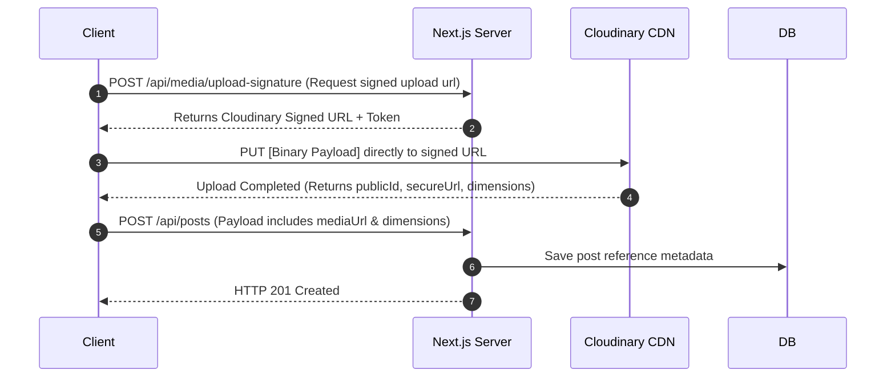
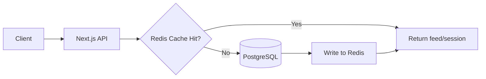

# JabWeMet: System Architecture & Design Specification
*Document Version: 1.0.0*  
*Target Audience: Stakeholders, Principal Engineers, VCs, and Core Engineering Team*

---

## 1. Requirement Analysis

### Product Mission
**JabWeMet** is a modern social networking platform designed from the ground up for Gen-Z and digital creators. By merging the features of high-engagement platforms like Instagram (reels, stories, posts), Threads/X (conversations, hashtags), and Discord/Snapchat (real-time chat, online presence, custom communities), JabWeMet is a comprehensive ecosystem for networking, content discovery, and creator monetization.

### Functional Requirements
- **Identity & Profiles**: Secure email/Google Auth, custom display names, bios, creator badges, verification metrics, and public/private account toggles.
- **Social Graph**: Unidirectional follow relationships, block/mute controls, and restriction logic to prevent harassment.
- **Content Engine**: High-fidelity single/carousel posts (photos/videos), reels (short-form looping video feed), and stories (24-hour ephemeral posts with viewer logs).
- **Interactions**: Double-tap likes, nested comments, mentions (`@username`), hashtags (`#trend`), and bookmarks.
- **Real-Time Communications**: Direct messaging with read receipts, typing indicator, online presence, and media attachments.
- **Moderation & Admin**: Content reporting system (spam, toxic content), user blocking, automated content filters, and analytics dashboard for creators and admins.

### Non-Functional Requirements
- **Availability**: 99.9% uptime target.
- **Latency**: Under 200ms API response time for feed retrieval; real-time messaging latency under 50ms (WebSocket RTT).
- **Scalability**: Capable of moving seamlessly from 0 to 1M+ active users.
- **Security**: Strict protection against OWASP Top 10 vulnerabilities (SQLi, XSS, CSRF, insecure authentication).
- **Mobile-First**: Fully responsive web design with optimized network asset size to ensure smooth rendering on mobile devices with variable connection speeds (3G/4G/5G).

---

## 2. High-Level Design

### Architecture Strategy: Modular Monolith
To maximize development velocity and simplify operations in the early stages without sacrificing long-term scalability, JabWeMet uses a **Modular Monolith** architecture. 

All modules (Auth, User, Feed, Post, Chat, etc.) live within a single codebase (Next.js 15), but maintain **strict architectural boundaries**:
- **Zero Direct Cross-Module Database Queries**: A module cannot query another module’s database tables directly.
- **Service-to-Service Interfaces**: If Module A needs data from Module B, it must call Module B’s exported Public Service method (e.g., `UserService.getUserProfile()`) rather than reaching into Module B's database models.
- **Decoupled Folder Structure**: Each module has its own logic, actions, types, and services.

This design makes it simple to split high-load modules (e.g., `Chat` or `Feed`) into independent microservices later if scaling limits are hit.

```mermaid
graph TD
    subgraph Client Layer
        Web["Web/Mobile Client (Next.js SPA)"]
    end

    subgraph API Gateway / Routing
        NextJS["Next.js App Router & Middleware"]
    end

    subgraph Modular Monolith (Next.js Server / Node.js Process)
        AuthMod["Auth Module"]
        UserMod["User & Profile Module"]
        PostMod["Post & Reel Module"]
        FeedMod["Feed Module"]
        ChatMod["Chat Module"]
        NotifMod["Notification Module"]
        MediaMod["Media Module"]
        SearchMod["Search Module"]
        AdminMod["Admin Module"]
    end

    subgraph External Infrastructure
        DB[(PostgreSQL)]
        Cloudinary[(Cloudinary CDN)]
        SocketSrv["Socket.IO Service"]
    end

    Web -->|HTTPS| NextJS
    Web -->|WebSockets| SocketSrv
    NextJS --> AuthMod
    NextJS --> UserMod
    NextJS --> PostMod
    NextJS --> FeedMod
    NextJS --> ChatMod
    NextJS --> NotifMod
    NextJS --> MediaMod
    NextJS --> SearchMod
    NextJS --> AdminMod

    %% Database connections (conceptualized via Prisma client)
    AuthMod & UserMod & PostMod & FeedMod & ChatMod & NotifMod & SearchMod & AdminMod -->|Prisma Client| DB
    MediaMod -->|Upload & Transcode| Cloudinary
    ChatMod -->|Publish Message| SocketSrv
```

### Why Advanced Distributed Technologies are Avoided at MVP
1. **Kubernetes**: Adds significant operational complexity (manifests, ingress, networking policies, cluster upgrades) requiring dedicated DevOps personnel.
2. **Kafka**: Heavy setup and management overhead. At MVP, transactional databases (PostgreSQL) or simple in-memory message brokers (like BullMQ with Redis) are more than enough.
3. **Cassandra**: Hard to run, model, and query compared to SQL databases. PostgreSQL JSONB columns provide similar wide-column flexibility without losing relational integrity.
4. **Hadoop/Spark**: Intended for multi-terabyte analytical queries. Standard SQL indexes and read-replicas satisfy MVP analytics requirements at a fraction of the cost.
5. **Service Mesh (e.g., Istio)**: Resolves microservice communication issues (mTLS, service discovery, load balancing). In a modular monolith, communication is done via in-process TypeScript function calls.

---

## 3. Low-Level Design

### Core Module Interfaces & Boundary Rules
Each module in JabWeMet is a self-contained unit. Here is the structure of interactions:

| Calling Module | Target Module | Interface Call | Business Rule |
| :--- | :--- | :--- | :--- |
| `Feed` | `Follow` | `FollowService.getFollowingIds(userId)` | Fetch followings to filter chronological feeds. |
| `Post` | `Media` | `MediaService.processAndUpload(file)` | Upload post assets to Cloudinary. |
| `Comment` | `Notification` | `NotificationService.sendCommentNotif(...)` | Notify post owner of a new comment response. |
| `Chat` | `User` | `UserService.getUserDetails(userId)` | Fetch sender metadata for a chat message list. |

### Module Communication Pattern Example
To avoid circular dependencies, modules register their actions with a global Event Dispatcher or use direct service injection with clean interfaces:

```typescript
// Example of cross-module interface rule
export interface IUserService {
  getUserProfile(userId: string): Promise<UserProfileDTO>;
  isUserBlockedBy(userId: string, targetId: string): Promise<boolean>;
}
```

---

## 4. Database Schema & Query Optimization

To support high-throughput social queries (e.g., "Get all posts by creators I follow, ordered by date"), our PostgreSQL schema uses optimized compound indexes and schema design patterns:

### Complete PostgreSQL Schema (Represented in Prisma)
The complete schema definition is detailed in [schema.prisma](file:///C:/Users/Vineet%20Singh/OneDrive/Desktop/Social%20media/prisma/schema.prisma).

### Key Query Optimizations
- **Compound Indexing on Follows**: We index `(followerId, followingId)` and its inverse `(followingId, followerId)` as a compound index. This ensures $O(1)$ lookup for checking if User A follows User B, and speed up queries to fetch follow lists.
- **Post Feed Indexing**: Indexes on `Posts (authorId, createdAt DESC)` optimize queries fetching posts from a user's following list.
- **Like Deduplication Indexing**: A unique compound constraint `(userId, targetId, targetType)` prevents users from liking the same item multiple times, and enables rapid query performance when rendering liked states on feed posts.
- **Full-Text Search Indexing**: Gin index on `tsvector` columns in user profiles and post captions to enable performance-oriented search query parsing without moving to a dedicated search cluster on day one.

---

## 5. API Design

### REST API Endpoints (JSON Payload Contracts)

#### Authentication (`/api/auth/*`)
- `POST /api/auth/signup` - Register a new user account.
- `POST /api/auth/login` - Authenticate credentials and return JWT in HTTP-Only cookies.
- `POST /api/auth/logout` - Clear cookies and terminate session.

#### Posts & Reels (`/api/posts/*`)
- `GET /api/posts/feed?limit=20&cursor=timestamp` - Retrieve chronological feed with cursor pagination.
- `POST /api/posts` - Create post.
- `DELETE /api/posts/:postId` - Soft-delete a post.

#### Real-time Interactions (`/api/comments/*`, `/api/likes/*`)
- `POST /api/likes` - Toggle like status on `post` or `comment`.
- `POST /api/posts/:postId/comments` - Post comment. Supports nested replies via `parentId`.

### WebSocket Events (Socket.IO Real-Time Engine)

```
Client                                                  Server
  | --- (connection) -----------------------------------> |
  | --- (join_room: { userId }) ------------------------> |
  | --- (send_message: { roomId, content, mediaUrl }) ---> |
  | <--- (new_message: { messageId, content, sender }) -- |
  | --- (typing_status: { roomId, isTyping: true }) ----> |
  | <--- (typing_status: { roomId, user, isTyping }) ---- |
```

---

## 6. DSA (Data Structures & Algorithms) Usage

| Data Structure / Algorithm | System Feature | Time Complexity | Space Complexity | Real-World Platform Usage |
| :--- | :--- | :--- | :--- | :--- |
| **Hash Maps** | Authentication & Cache | $O(1)$ | $O(N)$ | Session validation, active token tracking, fast memory lookups. |
| **Trie** | Auto-complete & Search | $O(L)$ where $L$ = prefix length | $O(\text{Words} \times L)$ | Predictive handle (`@`) and hashtag (`#`) autocompletion in search box. |
| **Graph** | Social Network Graph | $O(V + E)$ | $O(V + E)$ | Modeling follow/block structures. Finding mutual friends, follow chains. |
| **Priority Queue / Heap** | Trending Engine | $O(N \log K)$ | $O(K)$ | Finding Top-$K$ trending posts based on hourly engagement velocities. |
| **BFS / DFS** | Path finding / Recommendations | $O(V + E)$ | $O(V)$ | "People You May Know" module by traversing 2nd and 3rd degree connections. |
| **LRU Cache** | API caching layer | $O(1)$ | $O(M)$ | Fast retrieval of user profile configurations and hot static feeds. |
| **Top-K (Count-Min Sketch)**| Trending hashtags | $O(1)$ update | $O(w \times d)$ (constant) | Tracking viral hashtags in real-time across millions of streaming events. |

---

## 7. Feed Design & Ranking Formulas

### Chronological Feed
A simple query retrieves posts authored by users whom the active user follows, sorted by publication timestamp:
```sql
SELECT * FROM "Posts" 
WHERE "authorId" IN (SELECT "followingId" FROM "Followers" WHERE "followerId" = $1)
ORDER BY "createdAt" DESC 
LIMIT $2 OFFSET $3;
```
*(To scale, cursor-based pagination is preferred over OFFSET/LIMIT to avoid performance degradation at high page depths).*

### Ranked Feed Formula (The JabWeMet algorithm)
The algorithm weights user engagement types against item age to maximize content relevancy:

$$\text{Score} = \frac{W_{\text{type}} \times \left( w_l L + w_c C + w_s S + w_v V + w_w T_w \right) + \text{Creator\_Score}}{(\text{Age}_{\text{hours}} + 2)^G}$$

Where:
- $L, C, S, V$ = Total Likes, Comments, Shares/Saves, and Views respectively.
- $T_w$ = Average watch time in seconds (critical for Video/Reels ranking).
- $w_l = 1.0, w_c = 3.0, w_s = 5.0, w_v = 0.1, w_w = 0.5$ (engagement weights).
- $W_{\text{type}}$ = Affinity score multiplier based on past interactions with content category (e.g., if a user watches reels 80% of the time, reels category affinity weight is boosted).
- $\text{Creator\_Score}$ = Multiplier based on creator's average engagement rate and verification level.
- $\text{Age}_{\text{hours}}$ = Time elapsed since publication.
- $G$ = Gravity constant (typically $1.5$). A higher gravity causes post ranking scores to decay faster.

---

## 8. Media System Flow

A bottleneck in high-throughput social apps is processing media upload on the main application server. To bypass this, JabWeMet uses **Direct-to-CDN Uploads**:



### Compression & Transcoding Strategy
- **Images**: Automatically compressed to WebP/AVIF using Cloudinary dynamic tags (`q_auto,f_auto`).
- **Videos/Reels**: Transcoded into HLS (HTTP Live Streaming) format for adaptive bitrate streaming, ensuring smooth playback on slower networks.
- **Thumbnails**: Cloudinary generates optimized low-resolution placeholders dynamically via URL query parameters (`w_200,h_200,c_thumb`).

---

## 9. Search System Architecture

### Phase 1: PostgreSQL Full-Text Search (FTS)
Using native database capabilities allows us to support searching without introducing Elasticsearch infrastructure:
- Add a generated tsvector column combining `username`, `displayName`, and `bio`.
- Create a GIN index on this column.
- Query matching using:
  ```sql
  SELECT * FROM "Profiles" 
  WHERE to_tsvector('english', username || ' ' || "displayName" || ' ' || bio) @@ plainto_tsquery('english', $1);
  ```

### Phase 2: Elasticsearch Integration
As content grows, search requests are routed to an Elasticsearch/OpenSearch cluster:
- **Sync Mechanism**: Database changes trigger events via PostgreSQL Logical Replication (using Debezium or Prisma middleware triggers) to synchronize database states to Elasticsearch.
- **Capabilities**: Enables fuzzy matching, spelling corrections, multi-language processing, and search relevancy boosts for trending creators.

---

## 10. Chat System Architecture

Real-time messaging is powered by **Socket.IO** (WebSockets with HTTP polling fallback).

- **Presence Tracker**: Connected socket IDs map to user IDs in memory. When a client connects, their status is set to `online` and presence update events are dispatched to their followers.
- **Typing Indicator**: Client emits a `typing` event on keyboard input. The server broadcasts it to the recipient's room. A debounced event `stop_typing` fires after 3 seconds of inactivity.
- **Read Receipts**: When a chat window is active, the client sends a `read_receipt` event with the latest `messageId`. The server updates the database and sends a `message_read` event to the sender.

---

## 11. Security Architecture

- **JWT & Session Management**: Auth tokens are signed using HS256/RS256 with a 15-minute lifespan. Refresh tokens are stored in database sessions and sent to the client via `httpOnly`, `secure`, `SameSite=Strict` cookies.
- **OAuth2 Flow**: Standard OpenID Connect flow via Google Auth, mapping user identity directly to a local account.
- **RBAC (Role-Based Access Control)**:
  - `USER`: Regular interactions.
  - `CREATOR`: Access to deep analytics and video metrics.
  - `MODERATOR`: Ability to view reports, flag/remove content.
  - `ADMIN`: Full system controls and user terminations.
- **Rate Limiting**: Implemented at the API gateway layer using token-bucket rate limiters. API endpoints are restricted to 100 requests per minute per IP, while authentication endpoints are capped at 5 attempts per IP per minute.
- **OWASP Safeguards**:
  - *SQLi*: Handled natively via Prisma's parameterized queries.
  - *XSS*: Render inputs inside React nodes (auto-escaped) and sanitize rich text using DOMPurify.
  - *CSRF*: Enabled via SameSite cookie constraints and custom API headers requirement (e.g., `X-Requested-With`).

---

## 12. Future Redis Integration Phase

While a database-only architecture is suitable for the MVP, Redis is introduced to address scale bottlenecks:



### When is Redis needed?
1. **Feed Cache**: As users grow, database queries for follower feeds become resource-intensive. Pre-generating and caching the feed in a Redis Sorted Set (ZSET) avoids heavy SQL join overhead.
2. **Session Store**: Moving session storage to Redis speeds up validation times and decouples state from the primary PostgreSQL instance.
3. **Rate Limiting**: Utilizing Redis atomic increments (`INCRBY`) and key expirations allows for cluster-wide rate limiting.

---

## 13. AI Architecture (Future Phase)

For next-generation social engagement, a specialized Python/FastAPI service is introduced:

```
[Main Monolith (Node.js)] 
       │ (User actions / event logs)
       ▼
[Message Queue (RabbitMQ/Kafka)]
       │ 
       ▼
[AI Recommendation Engine (FastAPI & PyTorch)]
  ├── Collaborative Filtering (User recommendation)
  ├── Vector Database (pgvector / Qdrant)
  └── Moderation Pipeline (Spam, toxic text, NSFW image detection)
```

- **Tech Stack**: Python, FastAPI, PyTorch (for recommendation models), pgvector or Qdrant (for vector embeddings storage).
- **Spam & Moderation**: Integrated with automated APIs (e.g., Hive AI or custom YOLOv8 / BERT models) to scan media and caption content upon upload.

---

## 14. Scaling Roadmap

### Stage 1: 0 – 1,000 Users (The Launch)
- **Bottleneck**: Database connection management.
- **Infrastructure**: Single container for application, managed PostgreSQL instance (e.g., Neon or Supabase free tier).
- **Strategy**: Simple caching, database indexing, and asset offloading to Cloudinary.

### Stage 2: 1,000 – 10,000 Users (Initial Growth)
- **Bottleneck**: CPU spikes on application server.
- **Infrastructure**: Run two stateless container instances behind a load balancer (Render / Railway). Upgrade PostgreSQL instance.
- **Strategy**: Enable connection pooling via PgBouncer.

### Stage 3: 10,000 – 100,000 Users (Vocal Communities)
- **Bottleneck**: Read replication lag and slow feed queries.
- **Infrastructure**: Setup a PostgreSQL Read Replica. Add Redis layer for session caching and rate-limiting.
- **Strategy**: Cache active user profiles and hot metadata tables.

### Stage 4: 100,000 – 1,000,000 Users (Viral Scale)
- **Bottleneck**: High write IOPS on primary database, search timeouts.
- **Infrastructure**: Spin up Elasticsearch cluster for search. Extract WebSocket server out of Next.js backend to scale independently.
- **Strategy**: Implement fan-out-on-write feed pre-generation using background jobs (BullMQ).

### Stage 5: 1M+ Users (Global Presence)
- **Bottleneck**: Database table sizes exceeding memory limits.
- **Infrastructure**: Multi-region application server deployment. Sharded PostgreSQL database based on `userId`.
- **Strategy**: Transition queue messaging to Apache Kafka. Migrate container management to Kubernetes (EKS/GKE).

---

## 15. UI/UX Specifications

- **Theme Palette**: Deep pitch dark mode background (`#030303`), charcoal cards (`#121212`), with neon accent details (Indigo `#6366f1` and Electric Green `#10b981`).
- **Responsive Navigation**: Bottom navigation layout for mobile screens; left-sidebar layout for tablet and desktop views.
- **Micro-Animations**: Framer Motion transitions for feed double-tap likes, and page swaps.
- **Core User Journeys**:
  - *Infinite Feed*: Virtualized lists preventing page lag.
  - *Direct Message Drawer*: Smooth slide-over panels for instant access to conversations.
